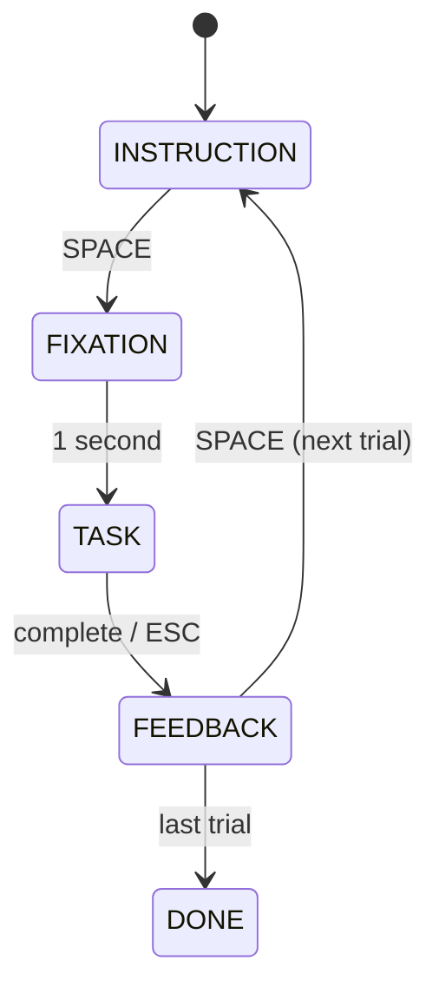

# From Screen to Scene

## Building VR Experiments with Python

A hands-on workshop for researchers

<br>

**Your Name** | Your Institution

April 2026

<!--
Welcome everyone. This workshop takes you from zero 3D experience to building a complete VR experiment paradigm in about four hours. Everything runs in Python — no Unity, no C#, no game-dev background needed.
-->

---

# Workshop Overview

| Time  | Module                              | Duration |
|-------|-------------------------------------|----------|
| 09:00 | Module 1: Welcome & Setup Check     | 20 min   |
| 09:20 | Module 2: Ursina Fundamentals       | 45 min   |
| 10:05 | **Break**                           | 15 min   |
| 10:20 | Module 3: Adding Interaction & Input | 40 min   |
| 11:00 | Module 4: Experiment Paradigm Design | 45 min   |
| 11:45 | **Break**                           | 15 min   |
| 12:00 | Module 5: Capstone -- MazeWalker-Py | 40 min   |
| 12:40 | Module 6: VR Roadmap & Wrap-up      | 15 min   |

<br>

**Two tracks** throughout: *Builders* (design & code) and *Runners* (configure & operate)

<!--
We have six modules with two breaks. Each module builds on the previous one. By the end you will have a working experiment with trials, conditions, timing, and data logging.
-->

---
layout: section
---

# Module 1
## Welcome & Setup Check

<!--
Let's start by getting to know the room and making sure everyone's environment works.
-->

---

# Who's in the Room?

Quick poll -- raise your hand:

<v-clicks>

- Who has written a PsychoPy experiment?
- Who has used Unity or Unreal?
- Who has never touched 3D programming?
- Who has a gamepad plugged in right now?

</v-clicks>

<br>

> This workshop assumes **basic Python** (variables, functions, classes). No 3D or VR experience needed.

<!--
This helps me calibrate the pace. Most participants will fall into the "basic Python, no 3D" camp, which is exactly the target audience.
-->

---

# The Landscape: Why Ursina?

<br>

| Tool       | Language | Learning Curve | VR Ready | Science Use      |
|------------|----------|----------------|----------|------------------|
| PsychoPy   | Python   | Low            | Limited  | Gold standard 2D |
| Unity      | C#       | Steep          | Full     | Dominant in VR   |
| **Ursina** | Python   | **Low**        | Via Panda3D | **Sweet spot** |
| Vizard     | Python   | Medium         | Full     | Commercial       |

<br>

**Ursina** sits at the sweet spot:

- Pure Python -- reuse your analysis skills
- Built on Panda3D -- production-grade 3D engine
- ~20 extra lines to go from desktop to headset VR

<!--
PsychoPy is great for 2D but limited for 3D navigation tasks. Unity is powerful but requires C# and a steep learning curve. Ursina gives us Python simplicity with real 3D capability.
-->

---

# Setup Check

Run this in your terminal:

```bash
cd vr-tutorial
source venv/bin/activate
python exercises/ex1_hello_ursina/hello_cube.py
```

You should see:

```python
from ursina import *

app = Ursina()
Entity(model='cube', color=color.orange, texture='white_cube')
EditorCamera()
app.run()
```

A window with a **spinning orange cube**. Middle-click to orbit, scroll to zoom.

If it works -- you are ready.

<!--
Let's take two minutes. Run hello_cube.py. If you see a cube in a window, give me a thumbs up. If you get an error, raise your hand and we'll debug together.
-->

---

# Architecture Overview

```
┌─────────────────────────────────────────────┐
│            Your Experiment Logic             │
│   (trials, conditions, data logging)         │
├─────────────────────────────────────────────┤
│         Ursina Engine (rendering)            │
│   Entity, Camera, Lighting, Colliders        │
├──────────────────┬──────────────────────────┤
│   Panda3D        │       pygame             │
│   (3D backend)   │   (gamepad input)        │
├──────────────────┴──────────────────────────┤
│            Python + OpenGL                   │
└─────────────────────────────────────────────┘
```

Three layers you will work with today:

1. **Ursina** -- rendering, physics, scene management
2. **pygame** -- gamepad/joystick input (sidecar pattern)
3. **Your code** -- experiment logic, trial sequencing, data

<!--
Think of this as a layer cake. Ursina handles all the 3D rendering. Pygame handles hardware input that Ursina's backend doesn't cover well on all platforms. Your experiment logic sits on top.
-->

---
layout: section
---

# Module 2
## Ursina Fundamentals

<!--
Now let's learn the building blocks. Everything in Ursina is an Entity.
-->

---

# The Entity: Everything Is One

```python
from ursina import *

app = Ursina()

# Every object in the scene is an Entity
cube = Entity(
    model='cube',         # shape: cube, sphere, quad, cylinder
    color=color.orange,   # color
    texture='white_cube', # surface pattern
    position=(0, 1, 0),   # where in 3D space
    scale=(2, 1, 1),      # stretch/shrink
    rotation=(0, 45, 0),  # orientation in degrees
    collider='box',       # physics boundary
)

app.run()
```

An Entity = **model** + **position** + **appearance** + optional **physics**

<!--
Entity is the one class to rule them all. Walls, floors, furniture, collectibles, even the player -- they're all Entities with different properties.
-->

---

# Coordinate System

```
        y (up)
        │
        │
        │
        │__________ x (right)
       /
      /
     /
    z (forward)
```

- **x** -- right (+) / left (-)
- **y** -- up (+) / down (-)
- **z** -- forward (+) / back (-)

<br>

`position=(3, 0.5, 4)` means: 3 units right, half a unit up, 4 units forward

> Ursina uses a **Y-up, left-handed** coordinate system (same as Panda3D)

<!--
This is the most important diagram today. When you place an object, you need to think in these three axes. Y is up -- different from some 2D frameworks where Y is often down.
-->

---

# Entity Properties at a Glance

| Property     | Type         | Example                | Effect                    |
|--------------|--------------|------------------------|---------------------------|
| `model`      | str / Mesh   | `'cube'`, `'sphere'`   | Shape of the object       |
| `color`      | Color        | `color.orange`         | Surface color             |
| `texture`    | str          | `'brick'`, `'grass'`   | Surface pattern           |
| `position`   | Vec3 / tuple | `(0, 1, 0)`           | Location in 3D space      |
| `scale`      | Vec3 / float | `(2, 1, 1)` or `0.5`  | Size multiplier           |
| `rotation`   | Vec3 / tuple | `(0, 45, 0)`          | Orientation in degrees    |
| `collider`   | str          | `'box'`, `'mesh'`      | Physics collision shape   |
| `parent`     | Entity       | `camera.ui`            | Attach to another entity  |
| `enabled`    | bool         | `True` / `False`       | Visible and active?       |

<!--
These are the properties you will use in every exercise. model and position are the minimum; everything else has sensible defaults.
-->

---

# Cameras: Two Modes

**EditorCamera** -- orbit, zoom, pan (great for building)

```python
EditorCamera()  # middle-click orbit, scroll zoom
```

<br>

**FirstPersonController** -- WASD + mouse look (great for experiments)

```python
from ursina.prefabs.first_person_controller import FirstPersonController

player = FirstPersonController()
player.gravity = 0       # no falling
player.position = (0, 1, 0)
```

<br>

| Feature          | EditorCamera     | FirstPersonController  |
|------------------|------------------|------------------------|
| Movement         | Orbit + zoom     | WASD + mouse look      |
| Physics          | None             | Gravity + collision    |
| Use case         | Scene building   | Experiments            |

<!--
EditorCamera is for building and debugging. FirstPersonController is what your participants will use -- it gives you WASD walking and mouse look out of the box.
-->

---

# Exercise 1: Build a Room

**Goal:** Construct a 3D room from primitives

**Time:** 15 minutes

<br>

**Steps:**

1. Open `exercises/ex2_build_a_room/template.py`
2. Create a floor (a flat quad)
3. Add four walls (position + rotate quads)
4. Place at least 3 furniture items (cubes, spheres, cylinders)
5. Add a `FirstPersonController` and walk around

<br>

**Key hint:** A flat floor = `quad` with `rotation_x=90`

```python
floor = Entity(model='quad', scale=(20, 20), rotation_x=90,
               color=color.dark_gray, texture='white_cube')
```

<!--
Open the template file. The TODO comments tell you what to build. Start with the floor, then add walls one at a time. Remember: a quad faces -z by default, so you need to rotate walls to face inward.
-->

---

# Exercise 2: Make It Real

**Goal:** Add physics and visual polish to your room

**Time:** 10 minutes

<br>

**Steps:**

1. Open `exercises/ex3_make_it_real/template.py`
2. Add `collider='box'` to walls and furniture
3. Replace plain colors with textures: `'brick'`, `'grass'`
4. Add `Sky()` for an atmospheric background
5. Add `DirectionalLight()` for depth and shadow

<br>

**Before vs After:**

| Without                          | With                             |
|----------------------------------|----------------------------------|
| Walk through walls               | Solid walls block you            |
| Flat gray surfaces               | Brick walls, grass floor         |
| Black void background            | Sky dome                         |

<!--
This exercise is quick -- just adding polish. Colliders are the most important part: without them, walls are just decoration. Textures and sky make a huge difference for immersion.
-->

---
layout: center
---

# Break

15 minutes

Back at **10:20**

<!--
Take a break. Stretch, get coffee. When you come back, we'll add interaction and gamepad input.
-->

---
layout: section
---

# Module 3
## Adding Interaction & Input

<!--
So far our scene is pretty but static. Let's make things happen when the player does something.
-->

---

# Ursina's Input Model

Three ways to respond to the player:

```python
# 1. update() — called every frame (~60 fps)
def update():
    if held_keys['w']:
        player.y += time.dt  # smooth continuous movement

# 2. input(key) — called once per key press/release
def input(key):
    if key == 'space':
        jump()

# 3. Entity methods — same names, scoped to an entity
class Player(Entity):
    def update(self):
        pass  # per-frame for this entity
    def input(self, key):
        pass  # input for this entity
```

| Method      | When              | Use case                    |
|-------------|-------------------|-----------------------------|
| `update()`  | Every frame       | Continuous checks, movement |
| `input()`   | Key press/release | Discrete actions, triggers  |
| `held_keys` | Every frame       | Sustained key holding       |

<!--
update runs 60 times per second -- use it for continuous checks like proximity detection. input fires once per keypress -- use it for discrete actions like starting a trial or jumping.
-->

---

# The Pygame Sidecar Pattern

**Problem:** Panda3D (Ursina's backend) has unreliable gamepad support on macOS.

**Solution:** Use pygame alongside Ursina for joystick input.

```python
import pygame

# Initialize once at startup
pygame.init()
pygame.joystick.init()
joystick = pygame.joystick.Joystick(0) if pygame.joystick.get_count() > 0 else None

DEADZONE = 0.2

def update():
    if joystick is None:
        return
    pygame.event.pump()  # required each frame

    # Left stick: movement
    lx = joystick.get_axis(0)  # left/right
    ly = joystick.get_axis(1)  # forward/back

    # Apply deadzone, then move player
    if abs(lx) > DEADZONE:
        player.position += player.right * lx * 5 * time.dt
    if abs(ly) > DEADZONE:
        player.position += player.forward * -ly * 5 * time.dt
```

<!--
The key insight: pygame and Ursina can coexist in the same process. Pygame handles only the gamepad; Ursina handles everything else. Call pygame.event.pump() every frame to keep it alive.
-->

---

# Gamepad Integration: Full Pattern

```python
def update():
    if joystick is None:
        return
    pygame.event.pump()

    # Left stick → movement (strafe + forward/back)
    lx = apply_deadzone(joystick.get_axis(0))
    ly = apply_deadzone(joystick.get_axis(1))

    # Right stick → camera look (yaw + pitch)
    rx = apply_deadzone(joystick.get_axis(2))
    ry = apply_deadzone(joystick.get_axis(3))

    # Move player relative to facing direction
    speed = 5 * time.dt
    player.position += player.forward * -ly * speed
    player.position += player.right * lx * speed

    # Rotate camera
    player.rotation_y += rx * 2
    camera.rotation_x = clamp(camera.rotation_x - ry * 2, -90, 90)
```

Run the demo: `python exercises/ex4_pick_up_star/gamepad_demo.py`

<!--
This is the complete gamepad pattern. Left stick controls movement relative to facing direction. Right stick controls the camera. The apply_deadzone function zeros out small axis values to prevent drift.
-->

---

# Exercise 3: Pick Up the Star

**Goal:** Add collectible objects with proximity detection

**Time:** 15 minutes

<br>

**Steps:**

1. Open `exercises/ex4_pick_up_star/template.py`
2. Create 3 gold star entities at different positions
3. Add a score counter on the HUD (`Text` on `camera.ui`)
4. In `update()`, check distance to each star
5. When close enough: hide the star, increment score
6. Show "Well done!" when all stars are collected

<br>

**Key pattern -- proximity detection:**

```python
COLLECT_DISTANCE = 2

def update():
    for star in stars:
        if star.enabled and distance(player.position, star.position) < COLLECT_DISTANCE:
            star.enabled = False
            score += 1
```

<!--
This is the interaction pattern you will use in real experiments: check distance each frame, trigger an event when a threshold is crossed. Same idea works for "participant reached the target" in a navigation task.
-->

---

# Input Abstraction

Why abstract input? So experiments work with keyboard **and** gamepad:

```python
class InputManager:
    """Unified input: keyboard or gamepad."""

    def get_movement(self):
        # Try gamepad first
        if self.joystick:
            return (self.get_axis(0), self.get_axis(1))
        # Fall back to keyboard
        return (
            held_keys['d'] - held_keys['a'],
            held_keys['w'] - held_keys['s'],
        )

    def get_action(self, key):
        """Check button press from either source."""
        if self.joystick and self.joystick.get_button(0):
            return True
        return key == 'space'
```

Same experiment code works on desktop and in the lab.

<!--
This abstraction layer means you write your experiment logic once and it works with whatever input device the participant uses. Very useful when you test on keyboard at your desk but run with gamepads in the lab.
-->

---
layout: section
---

# Module 4
## Experiment Paradigm Design

<!--
Now we move from game-like interaction to real experiment structure. This is where we add trials, conditions, timing, and data logging.
-->

---

# The Experiment Layer

Your 3D scene is the **stimulus**. On top of it, you need:

<v-clicks>

- **State machine** -- what phase of the trial are we in?
- **Trial sequencing** -- which condition, how many repeats, randomization
- **Timing** -- fixation duration, response windows, inter-trial intervals
- **Data logging** -- what happened, when, under which condition
- **Triggers** -- event markers for EEG/fMRI synchronization

</v-clicks>

<br>

> Ursina handles the *scene*. You handle the *experiment*.

<!--
Think of it as two layers: the 3D world that participants see and interact with, and the experiment logic that controls what they see and records what they do.
-->

---

# State Machine

Every trial follows a sequence of states:



Each state controls:
- What the participant **sees** (text, scene, fixation cross)
- What **input** is accepted (SPACE to advance, ESC to skip)
- What gets **logged** (triggers, timestamps)

<!--
This state machine is the backbone of any trial-based experiment. The participant reads instructions, sees a fixation cross, performs the task, and gets feedback. Then we repeat for the next trial.
-->

---

# Implementing the State Machine

```python
class Experiment(Entity):
    def __init__(self):
        super().__init__()
        self.state = 'INSTRUCTION'
        self.current_trial = 0
        # ... setup trials, UI, player

    def input(self, key):
        if key == 'space':
            if self.state == 'INSTRUCTION':
                self.show_fixation()
            elif self.state == 'FEEDBACK':
                self.next_trial()
        elif key == 'escape' and self.state == 'TASK':
            self.end_task(completed=False)

    def update(self):
        if self.state != 'TASK':
            return
        # Check proximity, collect stars, etc.
```

Subclassing `Entity` gives you `update()` and `input()` scoped to the experiment.

<!--
By making the experiment an Entity, Ursina automatically calls its update and input methods each frame. The state variable controls which code path runs. Clean separation of concerns.
-->

---

# Trial Sequencing

```python
# Define conditions and build trial list
trials = []
for _ in range(2):  # 2 repeats per condition
    trials.append({'condition': 'easy',   'n_stars': 1})
    trials.append({'condition': 'hard',   'n_stars': 3})

random.shuffle(trials)  # randomize order
```

<br>

| Trial | Condition | Stars |
|-------|-----------|-------|
| 1     | hard      | 3     |
| 2     | easy      | 1     |
| 3     | easy      | 1     |
| 4     | hard      | 3     |

<br>

**For real experiments:** use balanced Latin squares, blocked randomization, or counterbalancing as needed. The pattern is the same -- build a list of dicts, shuffle, iterate.

<!--
Each trial is a dictionary with its parameters. You build the full list upfront, shuffle it, then step through one at a time. Easy to extend: add more conditions, more repeats, or more parameters per trial.
-->

---

# Data Logging

Record one row per trial to CSV:

```python
import csv

csv_file = open('experiment_data.csv', 'w', newline='')
writer = csv.writer(csv_file)
writer.writerow(['trial', 'condition', 'n_stars', 'collected',
                 'duration_s', 'completed'])

# At the end of each trial:
writer.writerow([
    trial_number,
    trial['condition'],
    trial['n_stars'],
    score,
    f"{duration:.3f}",
    completed,
])
csv_file.flush()
```

<br>

**What to record:** trial number, condition, stimulus parameters, response, RT, accuracy, timestamps

> Always `flush()` after each trial -- if the program crashes, you keep the data.

<!--
CSV is the simplest and most portable format. One row per trial, columns for everything you might want to analyze later. Flush after every trial so you never lose data to a crash.
-->

---

# EEG Triggers

Mark events for time-locked neural recordings:

```python
# Define trigger codes
TRIG_FIXATION  = 1
TRIG_TASK_START = 2
TRIG_COLLECT    = 3
TRIG_TRIAL_END  = 4

def send_trigger(code):
    """Replace with LabJack/serial for real experiments."""
    print(f"[TRIGGER] code={code} at {time.time():.3f}")

# Send at key moments:
send_trigger(TRIG_FIXATION)    # fixation onset
send_trigger(TRIG_TASK_START)  # task begins
send_trigger(TRIG_COLLECT)     # participant collects a star
send_trigger(TRIG_TRIAL_END)   # trial ends
```

<br>

**In production:** replace `print` with a hardware call (LabJack, parallel port, serial). The trigger points stay the same.

<!--
For EEG experiments, you need millisecond-accurate event markers. We mock them with print statements today, but the architecture is identical to a real setup. Swap the send_trigger function body and you're done.
-->

---

# Exercise 4: Mini Experiment

**Goal:** Build a complete experiment with state machine and data logging

**Time:** 20 minutes

<br>

**Steps:**

1. Open `exercises/ex5_mini_experiment/template.py`
2. Define 2 conditions (easy: 1 star, hard: 3 stars) x 2 repeats
3. Implement the state machine: INSTRUCTION -> FIXATION -> TASK -> FEEDBACK
4. Log each trial to CSV (trial, condition, score, duration)
5. Add mock triggers at key events
6. Run it -- complete all 4 trials and check your CSV

<br>

**Builder track:** Implement from the template hints

**Runner track:** Read the solution, modify parameters (add a condition, change timing)

<!--
This is the big one. You're building a real experiment paradigm from scratch. The template has the structure laid out -- you fill in the state transitions and data logging. Take your time with this one.
-->

---

# Debrief: Mapping to Real Experiments

What you just built maps directly to real research:

| Workshop concept       | Real experiment equivalent         |
|------------------------|------------------------------------|
| Collect stars          | Navigate to target / reach object  |
| Easy vs hard condition | Set size, distance, distractor load |
| Proximity detection    | Response zone / collision trigger  |
| CSV data logging       | Behavioral data file               |
| Mock triggers          | EEG/fMRI event markers             |
| State machine          | Trial sequence controller          |

<br>

The architecture scales: swap the 3D task, keep the experiment logic.

<!--
Everything we did today with stars and rooms is a stand-in for real experimental manipulations. The state machine, data logging, and trigger architecture don't change when you switch to a different task.
-->

---
layout: center
---

# Break

15 minutes

Back at **12:00**

<!--
Second break. After this we look at a complete production experiment and then talk about going to actual VR headsets.
-->

---
layout: section
---

# Module 5
## Capstone: MazeWalker-Py

<!--
Let's see what a complete, production-quality experiment looks like using the same stack you've been learning.
-->

---

# MazeWalker-Py: Architecture

A complete maze-navigation experiment built with Ursina + pygame:

```
mazewalker-py/
├── experiment.py        # State machine + trial sequencing
├── maze_renderer.py     # Ursina scene: walls, floor, targets
├── input_manager.py     # Gamepad + keyboard abstraction
├── trigger.py           # EEG trigger interface (LabJack/mock)
├── config.yaml          # All parameters in one file
├── conditions.csv       # Trial list (condition, maze, target)
└── data/                # Output: behavioral CSV + trajectories
```

<br>

**Same patterns you learned today, at production scale.**

<!--
MazeWalker-Py is a real experiment used in research. Let's look at how it's organized and compare it to what you just built.
-->

---

# Your Code vs MazeWalker-Py

| Your Exercise 5                  | MazeWalker-Py                       |
|----------------------------------|--------------------------------------|
| State machine in one file        | Separate `experiment.py`             |
| Hard-coded conditions            | External `conditions.csv`            |
| Room from code                   | `maze_renderer.py` reads layout data |
| `print()` triggers               | `trigger.py` with LabJack driver     |
| Keyboard only                    | `input_manager.py` (keyboard + pad)  |
| CSV logging inline               | Dedicated logging with trajectories  |

<br>

**The patterns are identical.** The production version just separates concerns into files and uses configuration files instead of hard-coded values.

<!--
Compare these side by side. The experiment logic is the same state machine. The difference is organization: production code separates rendering, input, triggers, and configuration into their own modules.
-->

---

# Key Files Walkthrough

**experiment.py** -- the state machine you already know:

```python
class MazeExperiment(Entity):
    states = ['INSTRUCTION', 'FIXATION', 'NAVIGATION',
              'FEEDBACK', 'DONE']
    # Same pattern as your Exercise 5
```

**maze_renderer.py** -- builds the maze from data:

```python
def build_maze(layout):
    """Read a 2D grid and create wall entities."""
    for row, col in layout:
        Entity(model='cube', position=(col, 0.5, row),
               texture='brick', collider='box')
```

**trigger.py** -- hardware abstraction:

```python
class Trigger:
    def send(self, code):
        if self.device:
            self.device.write(code)  # LabJack
        else:
            print(f"[MOCK] {code}")  # development
```

<!--
Each file has a single responsibility. experiment.py manages state. maze_renderer.py builds the visual scene. trigger.py abstracts the hardware. You can test each piece independently.
-->

---

# Exercise 5: Make It Yours

**Goal:** Extend the experiment or explore MazeWalker-Py

**Time:** 20 minutes

<br>

**Builder track** -- pick one:

- Add a third condition (medium: 2 stars)
- Add a time limit per trial (30 seconds, auto-end)
- Log the player's position every 0.5 seconds (trajectory data)
- Add a practice trial before the real trials begin

<br>

**Runner track** -- explore and configure:

- Read through the MazeWalker-Py code on GitHub
- Change `config.yaml` parameters (maze size, time limits)
- Run the experiment and examine the output data

<!--
Choose the track that matches your role. Builders: extend the experiment you built in Exercise 4. Runners: explore MazeWalker-Py and practice configuring an experiment you didn't write.
-->

---

# Data Visualization: Trajectory Plots

What you can do with the logged data:

```python
import pandas as pd
import matplotlib.pyplot as plt

df = pd.read_csv('trajectory.csv')

# Plot path through the maze
plt.figure(figsize=(8, 8))
for trial in df.trial.unique():
    t = df[df.trial == trial]
    plt.plot(t.x, t.z, alpha=0.6, label=f'Trial {trial}')

plt.xlabel('X position')
plt.ylabel('Z position')
plt.title('Navigation Trajectories')
plt.legend()
plt.axis('equal')
plt.show()
```

Trajectory data reveals **strategy** -- not just whether they succeeded, but *how* they moved.

<!--
This is why 3D experiments are interesting for research. You don't just get reaction times -- you get full movement trajectories. You can analyze path efficiency, hesitation points, strategy differences between conditions.
-->

---
layout: section
---

# Module 6
## VR Roadmap & Wrap-up

<!--
Final module. Let's talk about what changes when you move from desktop 3D to actual VR headsets, and what stays the same.
-->

---

# Desktop 3D vs Headset VR

**What stays the same:**

- Entity-based scene construction
- Experiment state machine
- Trial sequencing and data logging
- Trigger architecture
- Python as the main language

<br>

**What changes:**

| Desktop                  | VR Headset                        |
|--------------------------|-----------------------------------|
| Mouse + keyboard         | Hand controllers + head tracking  |
| Monitor at 60 Hz         | Headset at 90 Hz (per eye)        |
| `FirstPersonController`  | VR camera rig (stereo rendering)  |
| No motion sickness       | Must manage comfort               |
| Simple deployment        | Need OpenXR runtime               |

<!--
The good news: about 90% of your code stays the same. The scene, the experiment logic, the data logging -- all identical. What changes is the camera setup and the input device.
-->

---

# The VR Diff: ~20 Lines

```python
# Desktop version (what you built today)
from ursina import *
player = FirstPersonController()

# VR version (Panda3D OpenXR)
from ursina import *
from ursina.xr import VRPlayer  # hypothetical — use Panda3D OpenXR

player = VRPlayer()
player.hand_left.on_grip = grab_object
player.hand_right.on_trigger = interact
```

The core change:

```diff
- player = FirstPersonController()
+ player = VRPlayer()
+ player.ipd = 0.063          # interpupillary distance
+ player.tracking_origin = 'floor'
+ player.render_stereo = True  # one pass per eye
```

Everything else -- your room, your stars, your state machine -- **unchanged**.

<!--
This is the payoff of using a Python 3D engine. When you're ready for VR, you swap the camera and input code. Your experiment logic, scene construction, and data logging carry over directly.
-->

---

# Resources

**Documentation:**

- Ursina: [ursinaengine.org](https://www.ursinaengine.org/)
- Panda3D: [panda3d.org](https://www.panda3d.org/)
- pygame: [pygame.org/docs](https://www.pygame.org/docs/)

<br>

**This workshop:**

- GitHub: `github.com/strongway/vr-tutorial`
- All exercises with templates and solutions
- Slides available online

<br>

**Recommended reading:**

- Panda3D OpenXR plugin documentation
- MazeWalker-Py source code and examples
- PsychoPy-to-Ursina migration notes (in workshop docs)

<!--
All the code and slides are on GitHub. The exercises have both templates and solutions, so you can work through them again at your own pace.
-->

---

# Homework

Adapt **Exercise 5** for your own research question:

<v-clicks>

1. **Change the task** -- replace star collection with your paradigm (search, navigation, reaching)
2. **Add your conditions** -- define meaningful experimental manipulations
3. **Design the CSV** -- what dependent variables will you analyze?
4. **Add trajectory logging** -- record position every N milliseconds
5. **Test with a colleague** -- have someone else run your experiment

</v-clicks>

<br>

> The best way to learn is to build something you actually need.

<!--
The workshop gave you the architecture. Now fill it with your own research question. Start small -- get one trial working, then scale up.
-->

---
layout: center
---

# Thank You!

<br>

## Questions?

<br>

**Your Name** | your.email@institution.edu

<br>

Workshop materials: `github.com/strongway/vr-tutorial`

<!--
Thank you for your time and attention. I'm happy to take questions now, and you can always reach me by email or open an issue on the GitHub repository.
-->
